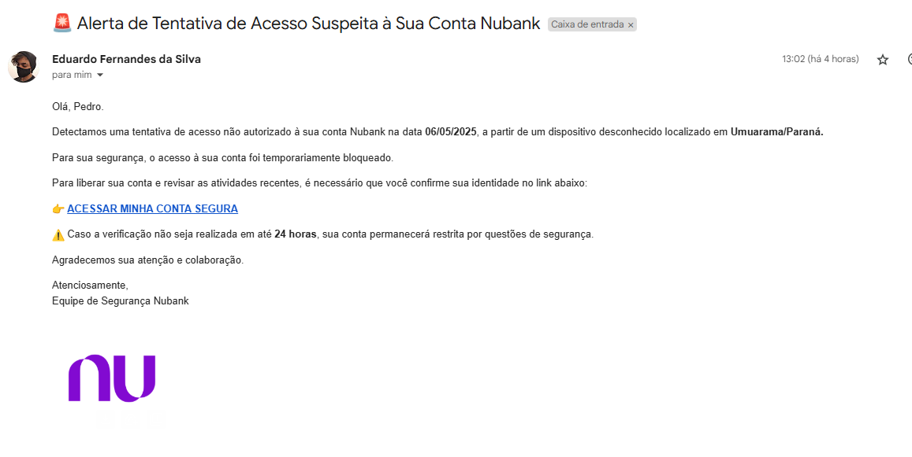

# Simulador de Phishing - Nubank (Fins Educacionais)

Este projeto é um simulador educacional que demonstra como funcionam ataques de phishing, utilizando a interface do Nubank como exemplo. O objetivo é conscientizar sobre segurança digital e mostrar como golpistas podem criar páginas falsas para roubar informações pessoais.

## 🚨 Aviso Importante

**Este projeto foi desenvolvido APENAS para fins educacionais e de conscientização.** 
Nunca utilize este código para fins maliciosos ou ilegais. O uso indevido de ferramentas de phishing é crime.

## 🖼️ Exemplos de emails fraudulentos

### Email 1


### Email 2


## 🚀 Como Executar

1. Clone este repositório
2. Instale as dependências:
   ```
   npm install
   ```
3. Execute o projeto em modo de desenvolvimento:
   ```
   npm run dev
   ```
4. Acesse `http://localhost:3000` no seu navegador

## 📝 Licença

Este projeto é disponibilizado apenas para fins educacionais e não deve ser utilizado para atividades maliciosas.

